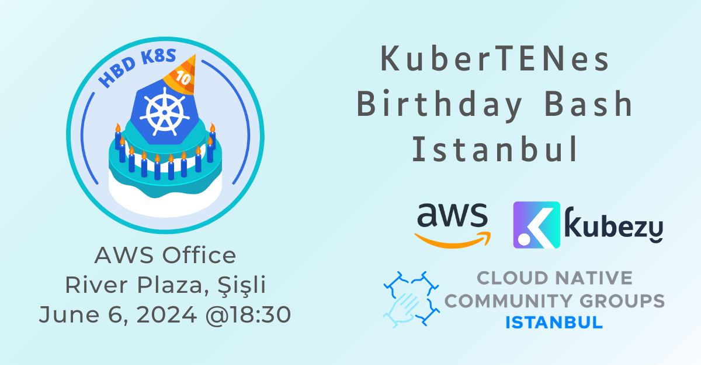

## Run Kubernetes v1.0

Start the VM:

```bash
qemu-system-x86_64 \
  -drive file=my-vm-disk.qcow2,format=qcow2 \
  -drive file=user-data.img,format=raw \
  -m 8192 \
  -smp cores=2 \
  -nographic \
  -netdev user,id=usernet,hostfwd=tcp::2222-:22 -device virtio-net,netdev=usernet
```

Connect to the instance

```bash
ssh -p 2222 -o StrictHostKeyChecking=no ubuntu@localhost
```

`lsb_release` will indicate Ubuntu 15.04:

```bash
ubuntu@ubuntu:~$ lsb_release -a
No LSB modules are available.
Distributor ID: Ubuntu
Description:    Ubuntu 15.04
Release:        15.04
Codename:       vivid
```

Check for cgroups v1, it should say `tmpfs`

```bash
stat -fc %T /sys/fs/cgroup/
```

Run etcd in the background as root and follow the logs, press `Ctrl-C` when you're ready, this will continue to run in background -

```bash
sudo bash -c 'etcd --listen-client-urls http://0.0.0.0:2379 --advertise-client-urls http://localhost:2379 &> /var/log/etcd.log &'; tail -f /var/log/etcd.log
```

Run kube-apiserver in the background as `root` and follow the logs, press `Ctrl-C` when you're ready, this will continue to run in background -

```bash
sudo bash -c 'kube-apiserver --etcd-servers=http://localhost:2379 --service-cluster-ip-range=10.0.0.0/16 --bind-address=0.0.0.0 --insecure-bind-address=0.0.0.0 &> /var/log/kube-apiserver.log &'; tail -f /var/log/kube-apiserver.log
```

With kube-apiserver running, we will be able to see this via cluster-info -

```bash
kubectl cluster-info
```

Show kubectl configuration -

```bash
kubectl config view
```

If we check with kubectl get nodes, although it will connect to the API server, currently we will have no nodes

```bash
kubectl get nodes
```

Run the kubelet in the background as root and follow the logs, you're looking for a message similar to "Successfully registered node ubuntu", press `Ctrl-C` when you're ready, this will continue to run in background. This will register this node with the api-server. Click "Reject" when you get a popup with the title "Authorize Cloud Shell" this is not required, kubelet is checking if the node is running on a cloud provider vm.

```bash
sudo bash -c 'kubelet --api-servers=http://localhost:8080 --pod-infra-container-image="registry.k8s.io/pause:0.8.0" &> /var/log/kubelet.log &'; tail -f /var/log/kubelet.log
```

If we show nodes, we will now see one node -

```bash
kubectl get nodes
```

Run the kube-scheduler in the background as root and follow the logs (expect to see no output),press `Ctrl-C` when you're ready, this will continue to run in background -

```bash
sudo bash -c 'kube-scheduler --master=http://localhost:8080 &> /var/log/kube-scheduler.log &'; tail -f /var/log/kube-scheduler.log
```

Run the kube-controller-manager in the background as root and follow the logs,press `Ctrl-C` when you're ready, this will continue to run in background -

```bash
sudo bash -c 'kube-controller-manager --master=http://localhost:8080 &> /var/log/kube-controller-manager.log &'; tail -f /var/log/kube-controller-manager.log
```

Run the kube-proxy in the background as root and follow the logs (expect to see no output),press `Ctrl-C` when you're ready, this will continue to run in background -

```bash
sudo bash -c 'kube-proxy --master=http://localhost:8080 &> /var/log/kube-proxy.log &'; tail -f /var/log/kube-proxy.log
```

Docker Hub will not work, owing to changes in the registry standards, therefore we will manually need to load images. We're going to load nginx:1.7 which at the time is 10 years old, we'll download this and pipe it direct to docker load -

```bash
curl -L https://github.com/cloud-native-istanbul/kubernetes-v1.0-lab/raw/main/images/nginx-1.7.tar | sudo docker load
```

And we'll go back in time and make nginx:1.7 nginx:latest through a manual tag, allowing us to use nginx with no tag in kubernetes -

```bash
sudo docker tag nginx:1.7 nginx:latest
```

We will also require a pause container image which at the time would have been 0.8.0 -

```bash
curl -L https://github.com/cloud-native-istanbul/kubernetes-v1.0-lab/raw/main/images/gcr_io_google_containers_pause_0_8_0.tar | sudo docker load
```

Show the available Docker images -

```bash
sudo docker images
```

Let's try out Kubernetes v1.0. The syntax is different, we'll run 5 pods which in turn, will create a replicationcontroller for us -

```bash
kubectl run nginx --image=nginx --replicas=5
```

Check the pods until they are running -

```bash
kubectl get pods
```

As Docker is the container runtime, you will be able to see the pods running in docker as well -

```bash
sudo docker ps -a
```

We can also expose these as a service -

```bash
kubectl expose rc nginx --port=80 --target-port=80
```

Query the available services -
```bash
kubectl get svc
```

Capture the svc IP -

```bash
SVC_IP=$(kubectl get svc nginx -o template --template={{.spec.clusterIP}})
```

And now you can curl that IP -

```bash
curl $SVC_IP
```

Congratulations, you've successfully used Kubernetes v1.0. Here's to looking forward to another 10 years of Kubernetes!

What actually do we have in this version? Checkout [API Timeline](https://kube-api.ninja/)
